# HYPERDIK

<p align="center">
  
</p>

<p align="center">
  
  
  
  
</p>

Autonomous perpetual futures trading — 177 markets, 5-second cycles, three AI models, self-optimizing.

| | |
|---|---|
| **Exchange** | [Hyperliquid](https://hyperliquid.xyz) perpetual futures |
| **Models** | Qwen 235B · Llama 4 Maverick · Llama 4 Scout · GPT‑4.1 |
| **Markets** | 177 coins, rotating 40 per cycle |
| **Cycle** | 5 seconds |
| **License** | [MIT](LICENSE) |
| **Daily cost** | ~$1.90 |


## Architecture

<p align="center">
  
</p>


## Quick Start

```bash
git clone https://github.com/winnerspiros/hyperdik.git
cd hyperdik

python3 -m venv .venv && source .venv/bin/activate
pip install hyperliquid-python-sdk eth-account xgboost numpy scikit-learn pandas

# Wallet
mkdir -p ~/.hyperliquid
cat > ~/.hyperliquid/config.json << 'EOF'
{"api_wallet": "0xYOUR_API", "api_private_key": "0xYOUR_KEY", "main_wallet": "0xYOUR_MAIN"}
EOF

# AI (optional)
export OPENROUTER_API_KEY=your_key

python3 -B hyperliquid_daemon.py
```


## AI Models

| Model | Role | Prompt | Completion |
|:---|:---|---:|---:|
| **Qwen 235B MoE** | Decisions, sizing, exits | $0.64/M | $1.28/M |
| **Llama 4 Maverick** | Coin picks, market scan | $1.00/M | $3.00/M |
| **Llama 4 Scout** | Fallback (rate-limited) | $0.40/M | $0.80/M |
| **GPT‑4.1** | Evolution, post-trade | $2.00/M | $8.00/M |

All via [OpenRouter](https://openrouter.ai). Prompt caching active on every call (90% off repeated system prompts).


## How Trades Work

### Entry

1. **AI scans** 40 coins per cycle, picks top 2–3 with direction and confidence
2. **5 signal layers** vote: composite · enriched ML · funding · whale · VWAP
3. **7 quality gates**: VWAP extremes · ML contradiction · composite floor · EV gate · regime · survival · chase block
4. **Micro-peak timing**: WebSocket mids at 150ms for up to 4s — catches best tick

### Exit

| Trigger | Behaviour |
|:---|:---|
| Breakeven lock | Net ≥ fees → SL moved to entry — **can't lose** |
| Profit tiers | 0.25% · 0.50% · 1.50% · 3.00% → escalating partial closes |
| AI re-check | 5 min flat → ask AI before kill (extends to 10 min if yes) |
| Trend-kill | 4h strongly against position → immediate |
| Bleed | Peak dropping + momentum turning → cut |
| Liquidation | <1% distance → force escape |


## Evolution — Autonomous Self-Optimization

Every ~1.7 hours, GPT‑4.1 reads the full system state and improves it autonomously:

- **Reads** full trade history, per-coin PnL, signal weights, AI prompts, daemon params, recent logs
- **Searches** 5 web queries for market context, strategy research, coin-specific news
- **Writes** code changes — rewrites AI prompts, modifies parameters, adjusts logic
- **Deploys** auto git-commits, restarts daemon if code changed
- **Cost** ~$0.04 per run (~$0.50/day)

**Prompt optimizer** runs alongside: records which prompts win, meta-prompts GPT‑4.1 for better versions, A/B tests, graduates winners.

Toggle everything in [`config.yaml`](config.yaml).


## Daily Running Cost

| Component | Frequency | Est. daily |
|:---|---:|---:|
| Live trading (Qwen + Llama) | ~2,880 calls | ~$1.10 |
| Post-trade analysis (GPT‑4.1) | Per trade close | ~$0.30 |
| Evolution (GPT‑4.1 + web) | Every ~1.7h | ~$0.50 |
| **Total** | | **~$1.90** |


## Modules

| Layer | Files |
|:---|:---|
| **AI** | `ai_decider.py` · `ai_validator.py` · `market_intel.py` |
| **Prediction** | `continuous_predictor.py` · `unified_predictor.py` · `perfect_predictor.py` · `ml_predictor.py` · `cryptogat_predictor.py` · `kronos_predictor.py` |
| **Signals** | `hyperliquid_strategy.py` · `unified_direction.py` · `vwap_signal.py` · `oi_delta.py` · `cvd_engine.py` · `cvd_divergence.py` · `taker_ratio.py` · `volume_delta.py` · `imbalance_trend.py` · `market_regime.py` · `market_structure.py` · `hurst_detector.py` · `chart_patterns.py` · `funding_acceleration.py` · `hyperliquid_funding_sniper.py` |
| **Data** | `context_enricher.py` · `market_analyzer.py` · `price_extremes.py` · `correlation_tracker.py` · `cross_exchange.py` · `sector_rotation.py` · `economic_calendar.py` |
| **Risk** | `hyperliquid_risk.py` · `hrp_sizing.py` · `ev_gate.py` |
| **Execution** | `hyperliquid_client.py` · `hyperliquid_execution.py` · `action_executor.py` · `hyperliquid_ws.py` |
| **Evolution** | `hyperliquid_evolution.py` · `prompt_optimizer.py` |
| **Strategy** | `hyperliquid_delta_neutral.py` · `hyperliquid_learner.py` · `hyperliquid_whale.py` |
| **Liquidation** | `liquidation_zones.py` · `liquidation_monitor.py` |
| **Peaks** | `peak_exhaustion_detector.py` · `pump_detector.py` |
| **Main** | `hyperliquid_daemon.py` — the 6,000-line main loop |

[`STRUCTURE.md`](STRUCTURE.md) has full details on every module.


## System Requirements

| | Minimum | Recommended |
|:---|---:|---:|
| RAM | 256 MB | 512 MB |
| CPU | 1 vCPU | 2 vCPU |
| Storage | 100 MB | 500 MB |
| Python | 3.10+ | 3.12+ |
| Network | 1 Mbps | 10 Mbps |

All storage is bounded: AI cache (200 entries, ~150 KB), logs (500 lines, ~1 MB), trade memory (500 entries). WebSocket buffers trimmed to 20 fills / 5 funding updates. No unbounded growth.


## Configuration

Toggle any feature in [`config.yaml`](config.yaml):

```yaml
ai.enabled:        true   # Master AI switch
trading.enabled:   true   # Set false for dry-run
evolution.enabled: true   # GPT‑4.1 autonomous optimizer
analysis.enabled:  true   # Per-trade AI review
entry.micro_peak:  true   # 150ms WS sampling
exit.breakeven_lock:true   # Never lose on fees alone
```


## Defaults

| | |
|:---|---:|
| Leverage | 6× (10–12× on full confluence) |
| Position size | 20% equity (35% on confluence) |
| Max positions | 3 |
| Entry | Market IOC · 0.5% slippage · micro-peak 4s |
| Cycle | 5 seconds |
| Markets | 177 perpetuals, rotating 40 per cycle |


## License

MIT — see [LICENSE](LICENSE)
